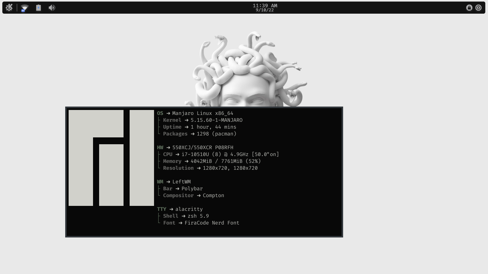
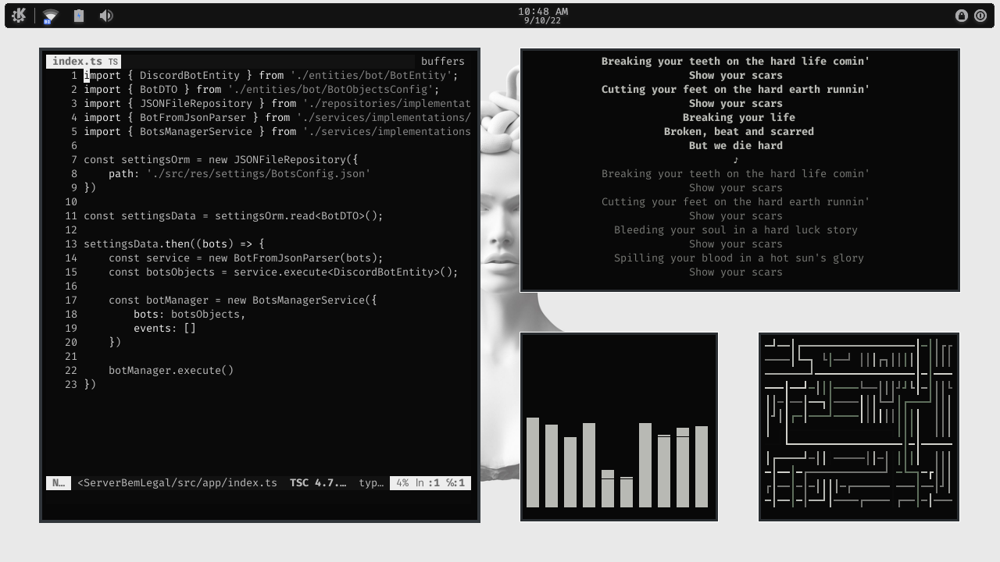

# KDE MONOCHROME DOTFILES
just a minimalist and clean ricing.

## screenshots:

***
## spicetify:
* color_scheme - UltraBlack
* current_theme - Sleek

## images elements:
* Manjaro
* Kwin krohnkite
* Alacritty
* Neovim
* Cava
* Pipes.sh
* Dunst
## KDE appearance:
* Application Style - Fusion
* Plasma Style - Monochrome
* Window Decoration - Breeze
* Accent color - #686b6f
* Font - FiraCode Nerd Font
* Icons - Inverse-black-dark
* Cursor - Mocu White Right

## author
 
<a href="https://github.com/lipe14-ops" style='padding: 15px' title="Rocketseat">Filipe Soares :computer:</a>

made with :heart: by <strong>Filipe</strong> :wave: reach me!!!

# dotfiles-KDE
